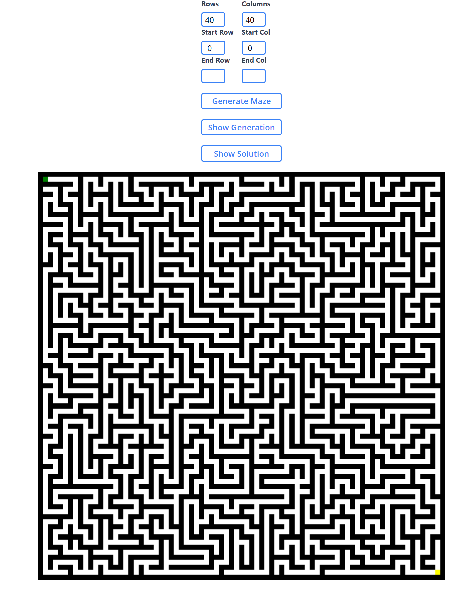

# MazeWebApp
A web application that allows users to generate and view mazes

[cameronrolfe.github.io/MazeWebApp/](https://cameronrolfe.github.io/MazeWebApp)

# Features

The input fields allow the users to customize the size, starting cell and end cell of the maze

The user can view the maze generation path by clicking the "Show Generation" button

The user can view the maze solution by clicking "Show Solution"